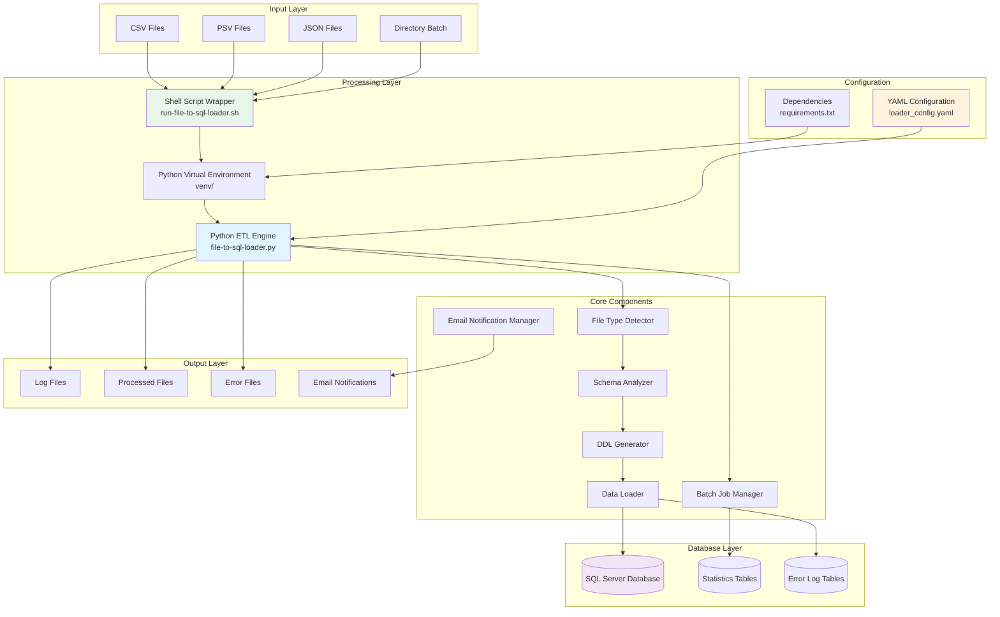
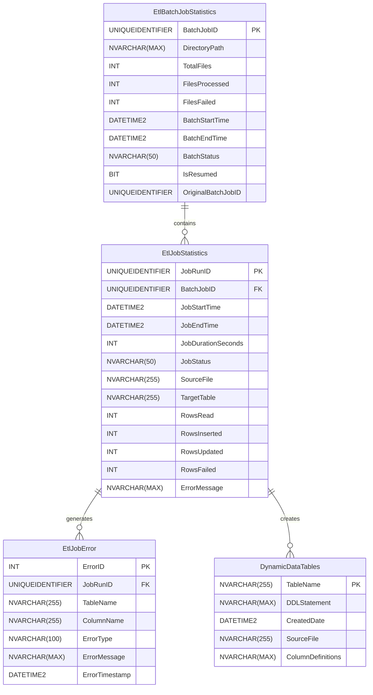

# NSPC ETL System Architecture Document

## Table of Contents
1. [System Overview](#system-overview)
2. [Code Analysis](#code-analysis)
3. [Data Flow Architecture](#data-flow-architecture)
4. [Technical Specifications](#technical-specifications)
5. [Visual Documentation](#visual-documentation)
6. [Component Interactions](#component-interactions)
7. [Configuration Management](#configuration-management)
8. [Error Handling and Monitoring](#error-handling-and-monitoring)
9. [Deployment and Operations](#deployment-and-operations)

## System Overview

The **NSPC ETL System** is a comprehensive file-to-database loading solution designed to process various file formats (CSV, PSV, JSON) and load them into SQL Server databases. The system features automatic schema inference, robust error handling, batch processing capabilities, and comprehensive logging and monitoring.

### Key Features
- **Multi-format Support**: Handles CSV, PSV (pipe-separated values), and JSON files
- **Automatic Schema Inference**: Dynamically analyzes file structure and generates appropriate SQL DDL
- **Batch Processing**: Supports both single file and directory-based batch processing with checkpointing
- **Error Handling**: Configurable transaction modes (strict/tolerant) with detailed error logging
- **Monitoring**: Comprehensive job statistics and error tracking
- **Email Notifications**: Automated email alerts for job completion status with detailed summaries
- **Environment Management**: Automated Python virtual environment setup and dependency management

### System Purpose
The ETL system serves as a bridge between various data sources and SQL Server databases, providing:
- Automated data ingestion from multiple file formats
- Dynamic table creation based on data structure
- Robust error handling and recovery mechanisms
- Comprehensive audit trails and monitoring capabilities
- Scalable batch processing for large datasets

## Code Analysis

### Main Python Script (`src/file-to-sql-loader.py`)

#### Core Classes and Components

**FileToSQLLoader Class**
```python
class FileToSQLLoader:
    """Main class for processing files and loading into SQL Server."""
    
    def __init__(self, config: Dict[str, Any], batch_job_id: Optional[str] = None):
        self.config = config
        self.batch_job_id = batch_job_id
        self.connection = None
        self.table_name = None
        self.columns_info = {}
        self.total_rows = 0
        self.processed_rows = 0
        self.error_rows = 0
```

**Responsibilities:**
- **Schema Analysis**: Analyzes DataFrame structure to infer column types and constraints
- **DDL Generation**: Creates SQL Server table definitions based on inferred schema
- **Data Loading**: Handles data insertion with configurable transaction semantics
- **Error Management**: Tracks and logs processing errors with configurable thresholds
- **Statistics Tracking**: Records job execution metrics and performance data

**BatchJobManager Class**
```python
class BatchJobManager:
    """Manages batch job lifecycle and checkpointing."""
    
    def __init__(self, config: Dict[str, Any], directory_path: str, connection):
        self.config = config
        self.directory_path = directory_path
        self.connection = connection
```

**Responsibilities:**
- **Checkpointing**: Manages batch job state and enables resumption of interrupted processes
- **File Tracking**: Maintains records of processed and pending files
- **Batch Statistics**: Tracks overall batch processing metrics and status

**EmailNotificationManager Class**
```python
class EmailNotificationManager:
    """Manages email notifications for ETL job completion status."""

    def __init__(self, config: Dict[str, Any]):
        self.config = config
        self.email_config = config.get('email_notifications', {})
        self.enabled = self.email_config.get('enabled', False)
```

**Responsibilities:**
- **Email Composition**: Generates HTML email content with job summaries and status
- **SMTP Communication**: Handles secure email delivery via configurable SMTP servers
- **Status Reporting**: Sends detailed completion reports for both single file and batch operations
- **Error Notification**: Provides immediate alerts for failed processing jobs
- **Multi-recipient Support**: Distributes notifications to multiple stakeholders

#### Key Functions

**File Type Detection:**
- Automatically detects CSV, PSV, and JSON formats by analyzing file content
- Uses pattern matching and structural analysis for accurate identification
- Handles edge cases and malformed files gracefully

**Schema Inference:**
- Analyzes pandas DataFrame to understand column characteristics
- Infers appropriate SQL Server data types (INT, DECIMAL, NVARCHAR, DATETIME2)
- Calculates optimal column lengths with configurable overrides
- Handles NULL values and data type conflicts

**Data Loading Strategies:**
- **Strict Mode**: All-or-nothing processing with pre-validation
- **Tolerant Mode**: Partial success with configurable error thresholds
- **Batch Processing**: Efficient bulk operations with transaction management

### Shell Script Wrapper (`run-file-to-sql-loader.sh`)

#### Core Responsibilities

**Environment Management:**
- Automatically creates and manages Python virtual environments
- Installs required packages from requirements.txt
- Handles cross-platform compatibility (Unix/Linux/Windows)

**Validation and Setup:**
- Validates input paths, configuration files, and processing modes
- Verifies Python installation and required packages
- Ensures YAML configuration files are syntactically correct

**Execution Management:**
- Provides comprehensive CLI with help and usage information
- Manages execution errors and provides meaningful feedback
- Supports verbose logging and colored output for better user experience

## Data Flow Architecture

### Input Processing Pipeline

1. **File Discovery**: System identifies input files (single file or directory batch)
2. **File Type Detection**: Automatic detection of CSV, PSV, or JSON format
3. **Data Loading**: Files loaded into pandas DataFrames for processing
4. **Schema Analysis**: Column types, lengths, and constraints inferred from data
5. **DDL Generation**: SQL Server table definitions created based on schema
6. **Table Management**: Existing tables handled per configuration (drop/recreate, append, fail)
7. **Data Loading**: Records inserted with configurable transaction semantics
8. **Error Handling**: Failed records logged and processed per error threshold settings
9. **Statistics Recording**: Job metrics and performance data recorded to database

### Processing Modes

**Single File Mode:**
- Direct processing of individual files
- Immediate feedback and error reporting
- Suitable for ad-hoc data loading tasks

**Directory Batch Mode:**
- Processes all supported files in a directory
- Supports checkpointing and resumption
- Ideal for large-scale data migration projects
- Maintains comprehensive batch statistics

## Technical Specifications

### Supported File Formats
- **CSV**: Comma-separated values with automatic delimiter detection
- **PSV**: Pipe-separated values (|) with consistent column structure
- **JSON**: JavaScript Object Notation with array or object structures

### Database Connectivity
- **Primary Driver**: ODBC Driver 17 for SQL Server
- **Alternative Drivers**: pyodbc and pymssql for compatibility
- **Connection Features**: Trusted connections, SSL support, connection pooling

### Data Type Mapping
- **String Data**: NVARCHAR with automatic length detection and manual overrides
- **Numeric Data**: INT for integers, DECIMAL(18,4) for floating-point values
- **Date/Time Data**: DATETIME2 with multiple format pattern support
- **NULL Handling**: Configurable NOT NULL constraints per column

### Performance Features
- **Batch Processing**: Configurable batch sizes for optimal memory usage
- **Checkpointing**: Resume interrupted batch jobs from last successful state
- **Error Thresholds**: Configurable limits to prevent runaway error conditions
- **Memory Management**: Efficient DataFrame processing with sampling for large files

## Visual Documentation

### System Architecture Overview



### ETL Data Processing Flow

```mermaid
flowchart TD
    START([Start ETL Process]) --> INPUT{Input Type?}
    
    INPUT -->|Single File| SINGLE[Single File Mode]
    INPUT -->|Directory| BATCH[Batch Processing Mode]
    
    SINGLE --> DETECT[Detect File Type<br/>CSV/PSV/JSON]
    BATCH --> DISCOVER[Discover All Files<br/>in Directory]
    
    DISCOVER --> CHECKPOINT{Resume Existing<br/>Batch Job?}
    CHECKPOINT -->|Yes| RESUME[Load Pending Files<br/>from Checkpoint]
    CHECKPOINT -->|No| NEWBATCH[Create New<br/>Batch Job]
    
    RESUME --> FILELOOP[Process Each File]
    NEWBATCH --> FILELOOP
    DETECT --> FILELOOP
    
    FILELOOP --> LOAD[Load File into<br/>pandas DataFrame]
    LOAD --> ANALYZE[Analyze Schema<br/>& Infer Types]
    
    ANALYZE --> TABLEGEN[Generate Table Name<br/>from Filename]
    TABLEGEN --> TABLECHECK{Table Exists?}
    
    TABLECHECK -->|No| CREATEDDL[Generate CREATE<br/>TABLE DDL]
    TABLECHECK -->|Yes| TABLEMODE{Table Mode?}
    
    TABLEMODE -->|drop_recreate| DROPTABLE[DROP TABLE]
    TABLEMODE -->|append| INSERTDATA[Insert Data]
    TABLEMODE -->|fail| ERROR[Fail with Error]
    
    DROPTABLE --> CREATEDDL
    CREATEDDL --> CREATETABLE[Execute CREATE TABLE]
    CREATETABLE --> INSERTDATA
    
    INSERTDATA --> TRANSMODE{Transaction Mode?}
    TRANSMODE -->|strict| STRICT[All-or-Nothing<br/>Transaction]
    TRANSMODE -->|tolerant| TOLERANT[Tolerant Transaction<br/>with Error Threshold]
    
    STRICT --> VALIDATE[Pre-validate<br/>All Rows]
    VALIDATE --> VALIDOK{All Rows Valid?}
    VALIDOK -->|Yes| BATCHINSERT[Batch Insert<br/>All Rows]
    VALIDOK -->|No| MOVEERROR[Move File to<br/>Error Directory]
    
    TOLERANT --> ROWLOOP[Process Each Row]
    ROWLOOP --> ROWINSERT{Insert Row}
    ROWINSERT -->|Success| ROWSUCCESS[Increment Success Count]
    ROWINSERT -->|Error| ROWERROR[Increment Error Count]
    
    ROWERROR --> THRESHOLD{Error Count ><br/>Threshold?}
    THRESHOLD -->|Yes| MOVEERROR
    THRESHOLD -->|No| CONTINUE[Continue Processing]
    
    ROWSUCCESS --> CONTINUE
    CONTINUE --> MOREROWS{More Rows?}
    MOREROWS -->|Yes| ROWLOOP
    MOREROWS -->|No| COMMIT[Commit Transaction]
    
    BATCHINSERT --> COMMIT
    COMMIT --> MOVEPROCESSED[Move File to<br/>Processed Directory]
    
    MOVEPROCESSED --> STATS[Record Job Statistics]
    MOVEERROR --> ERRORSTATS[Record Error Statistics]
    
    STATS --> BATCHMODE{Batch Mode?}
    ERRORSTATS --> BATCHMODE
    ERROR --> BATCHMODE
    
    BATCHMODE -->|Yes| MOREFILES{More Files<br/>to Process?}
    BATCHMODE -->|No| END([End Process])
    
    MOREFILES -->|Yes| FILELOOP
    MOREFILES -->|No| BATCHSTATS[Update Batch<br/>Statistics]
    
    BATCHSTATS --> END
    
    style START fill:#c8e6c9
    style END fill:#ffcdd2
    style ERROR fill:#ffcdd2
    style MOVEERROR fill:#ffcdd2
    style COMMIT fill:#e1f5fe
    style STATS fill:#f3e5f5
```



### ETL System Execution Sequence

```mermaid
sequenceDiagram
    participant User
    participant Shell as Shell Script
    participant VEnv as Virtual Environment
    participant Python as Python ETL Engine
    participant FileSystem as File System
    participant Database as SQL Server
    participant Logger as Logging System

    User->>Shell: Execute run-file-to-sql-loader.sh
    Shell->>Shell: Parse command line arguments
    Shell->>Shell: Validate input parameters

    Shell->>VEnv: Setup/activate virtual environment
    VEnv->>VEnv: Install dependencies from requirements.txt
    VEnv-->>Shell: Environment ready

    Shell->>Python: Launch file-to-sql-loader.py
    Python->>FileSystem: Load YAML configuration
    FileSystem-->>Python: Configuration loaded

    Python->>Logger: Setup logging system
    Logger->>FileSystem: Create log files

    alt Single File Mode
        Python->>FileSystem: Read input file
        FileSystem-->>Python: File data
        Python->>Python: Detect file type (CSV/PSV/JSON)
        Python->>Python: Load into pandas DataFrame
    else Directory Batch Mode
        Python->>Database: Check for existing batch jobs
        Database-->>Python: Batch job status
        Python->>FileSystem: Discover all files in directory
        FileSystem-->>Python: File list
        loop For each file
            Python->>FileSystem: Read file
            FileSystem-->>Python: File data
            Python->>Python: Detect file type
            Python->>Python: Load into DataFrame
        end
    end

    Python->>Python: Analyze DataFrame structure
    Python->>Python: Infer SQL data types
    Python->>Python: Generate table name from filename

    Python->>Database: Connect to SQL Server
    Database-->>Python: Connection established

    Python->>Database: Check if target table exists
    Database-->>Python: Table existence status

    alt Table doesn't exist
        Python->>Python: Generate CREATE TABLE DDL
        Python->>Database: Execute CREATE TABLE
        Database-->>Python: Table created
    else Table exists and mode is drop_recreate
        Python->>Database: DROP TABLE
        Python->>Python: Generate CREATE TABLE DDL
        Python->>Database: Execute CREATE TABLE
        Database-->>Python: Table recreated
    else Table exists and mode is append
        Note over Python: Use existing table
    end

    alt Strict Transaction Mode
        Python->>Python: Pre-validate all rows
        alt All rows valid
            Python->>Database: Begin transaction
            Python->>Database: Batch insert all rows
            Database-->>Python: Insert successful
            Python->>Database: Commit transaction
            Python->>FileSystem: Move file to processed directory
        else Validation failed
            Python->>FileSystem: Move file to error directory
            Python->>Logger: Log validation errors
        end
    else Tolerant Transaction Mode
        Python->>Database: Begin transaction
        loop For each row
            Python->>Database: Insert row
            alt Insert successful
                Database-->>Python: Success
            else Insert failed
                Database-->>Python: Error
                Python->>Python: Increment error count
                alt Error count > threshold
                    Python->>Database: Rollback transaction
                    Python->>FileSystem: Move file to error directory
                    Note over Python: Exit processing loop
                else Error count within threshold
                    Note over Python: Continue processing
                end
            end
        end
        alt Processing completed successfully
            Python->>Database: Commit transaction
            Python->>FileSystem: Move file to processed directory
        else Processing aborted due to errors
            Note over Python: File already moved to error directory
        end
    end

    Python->>Database: Record job statistics
    Python->>Database: Record error logs (if any)
    Python->>Logger: Log processing results

    alt Batch Mode
        Python->>Database: Update batch statistics
    end

    Python-->>Shell: Processing complete
    Shell-->>User: Execution finished
```



### ETL System Database Schema



## Component Interactions

### Core Component Relationships

**FileToSQLLoader ↔ BatchJobManager**
- BatchJobManager creates and manages FileToSQLLoader instances for each file
- FileToSQLLoader reports processing results back to BatchJobManager
- Shared database connection for efficiency and transaction coordination

**Schema Analyzer ↔ DDL Generator**
- Schema Analyzer provides inferred data types and constraints
- DDL Generator creates SQL Server-compatible table definitions
- Supports manual overrides through configuration for disputed columns

**Data Loader ↔ Error Handler**
- Data Loader reports row-level processing errors
- Error Handler tracks error counts against configurable thresholds
- Determines whether to continue processing or abort based on error rates

### Configuration Dependencies

**YAML Configuration Structure:**
```yaml
database:
  driver: 'ODBC Driver 17 for SQL Server'
  server: 'localhost'
  database: 'TestDB'
  username: 'sa'
  password: 'YourStrong@Passw0rd'

loader:
  table_mode: 'drop_recreate'  # 'drop_recreate', 'append', 'fail'
  batch_size: 1000
  max_retries: 3
  max-row-errors: 100
  transaction_mode: 'tolerant'  # 'strict' or 'tolerant'

ddl:
  not_null_columns:
    - 'createdate'
    - 'databasename'
    - 'financialclass'

logging:
  enabled: true
  level: 'INFO'
  path: 'logs'
  format: '%(asctime)s - %(name)s - %(levelname)s - %(message)s'

job_statistics:
  enabled: true
  table_name: 'EtlJobStatistics'

error_logging:
  enabled: true
  table_name: 'EtlJobError'

batch_processing:
  enable_checkpointing: true
  resume_incomplete_batches: true
  max_resume_age_hours: 24
  cleanup_completed_batches: false

tables:
  # Manual column length overrides
  your_table_name:
    disputed_columns:
      your_column_name:
        max_length: 150

email_notifications:
  enabled: true
  smtp_server: 'smtp.gmail.com'
  smtp_port: 587
  use_tls: true
  username: 'your-email@gmail.com'
  password: 'your-app-password'
  from_email: 'your-email@gmail.com'
  to_emails:
    - 'admin@company.com'
    - 'data-team@company.com'
    - 'manager@company.com'
```

## Configuration Management

### Environment Configuration

**Virtual Environment Management:**
- Automatic creation of isolated Python environments
- Dependency installation from requirements.txt
- Cross-platform compatibility (Windows/Unix/Linux)
- Version management and conflict resolution

**Dependency Management:**
```txt
# Core Dependencies
sqlalchemy>=1.4.0,<3.0.0
pyodbc>=4.0.0,<6.0.0
pymssql>=2.2.0,<3.0.0
pandas>=1.3.0,<3.0.0
pyyaml>=5.4.0,<7.0.0
```

### Runtime Configuration

**Command Line Interface:**
```bash
# Single file processing
./run-file-to-sql-loader.sh data.csv

# Directory batch processing
./run-file-to-sql-loader.sh /path/to/data/directory/

# Custom configuration
./run-file-to-sql-loader.sh data.csv --config custom_config.yaml

# Setup and validation
./run-file-to-sql-loader.sh --setup-only
./run-file-to-sql-loader.sh --check-deps
```

**Processing Modes:**
- **Single File Mode**: Direct processing of individual files
- **Directory Batch Mode**: Automated processing of all files in a directory
- **Force Modes**: Override automatic detection with --file or --directory flags

## Error Handling and Monitoring

### Error Classification

**File-Level Errors:**
- File not found or inaccessible
- Unsupported file format
- Malformed data structure
- Configuration errors

**Row-Level Errors:**
- Data type conversion failures
- Constraint violations
- NULL value in NOT NULL column
- String length exceeding column limits

**System-Level Errors:**
- Database connection failures
- Insufficient permissions
- Disk space limitations
- Memory allocation errors

### Monitoring and Alerting

**Job Statistics Tracking:**
- Processing start and end times
- Row counts (read, inserted, updated, failed)
- Error rates and types
- Performance metrics

**Batch Processing Monitoring:**
- Overall batch progress
- File-level success/failure rates
- Checkpointing and resumption tracking
- Resource utilization metrics

**Log Management:**
- Structured logging with configurable levels
- Separate log files per job execution
- Colored console output for real-time monitoring
- Error log aggregation and analysis

**Email Notifications:**
- Automated email alerts for job completion status
- HTML-formatted reports with detailed job summaries
- Support for multiple recipients and distribution lists
- Configurable SMTP settings for various email providers
- Status-based email subjects with visual indicators (✅ Success, ⚠️ Warnings, ❌ Failures)
- Comprehensive job metrics including processing times, row counts, and error details

### Recovery Mechanisms

**Checkpointing System:**
- Automatic save points during batch processing
- Resume capability for interrupted jobs
- Configurable resume age limits
- Duplicate processing prevention

**Error Recovery:**
- Configurable retry mechanisms
- Graceful degradation with partial success
- Automatic file quarantine for problematic data
- Manual intervention points for critical errors

## Deployment and Operations

### System Requirements

**Software Dependencies:**
- Python 3.7 or higher
- SQL Server with ODBC Driver 17
- Sufficient disk space for logs and temporary files
- Network connectivity to target database

**Hardware Recommendations:**
- Minimum 4GB RAM for large file processing
- SSD storage for optimal I/O performance
- Multi-core CPU for parallel processing capabilities

### Installation and Setup

**Quick Start:**
1. Clone or download the ETL system files
2. Run `./run-file-to-sql-loader.sh --setup-only` to initialize environment
3. Configure database connection in `src/loader_config.yaml`
4. Test with `./run-file-to-sql-loader.sh --check-deps`
5. Process files with `./run-file-to-sql-loader.sh <input_path>`

**Production Deployment:**
- Schedule batch jobs using cron or task scheduler
- Implement log rotation and archival policies
- Set up monitoring and alerting for job failures
- Configure backup and recovery procedures

### Maintenance and Troubleshooting

**Regular Maintenance:**
- Monitor log file growth and implement rotation
- Review and optimize database statistics tables
- Update Python dependencies as needed
- Validate configuration files for syntax errors

**Common Issues and Solutions:**
- **Connection Timeouts**: Increase connection timeout values in configuration
- **Memory Issues**: Reduce batch sizes or implement streaming processing
- **Permission Errors**: Verify database user permissions and file system access
- **Data Type Conflicts**: Use manual column overrides in configuration

### Performance Optimization

**Tuning Recommendations:**
- Adjust batch sizes based on available memory
- Use appropriate transaction modes for data quality requirements
- Implement parallel processing for large directory batches
- Optimize database indexes for statistics tables

**Monitoring Performance:**
- Track processing times per file and batch
- Monitor memory usage during large file processing
- Analyze error rates and patterns
- Review database performance metrics

## Conclusion

The NSPC ETL System provides a robust, scalable solution for automated data ingestion from various file formats into SQL Server databases. Its comprehensive feature set, including automatic schema inference, configurable error handling, and batch processing capabilities, makes it suitable for both ad-hoc data loading tasks and large-scale production deployments.

The system's modular architecture, extensive configuration options, and comprehensive monitoring capabilities ensure reliable operation while providing the flexibility needed to handle diverse data processing requirements.

### Key Benefits

- **Automation**: Reduces manual effort in data loading processes
- **Reliability**: Comprehensive error handling and recovery mechanisms
- **Scalability**: Supports both single files and large batch operations
- **Monitoring**: Detailed logging and statistics for operational visibility
- **Flexibility**: Configurable processing modes and data type handling
- **Maintainability**: Clear separation of concerns and modular design
